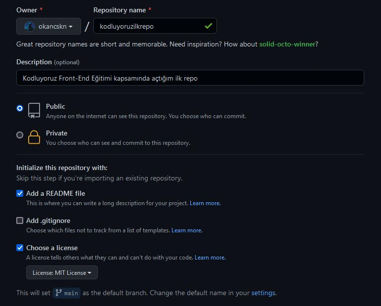

# Kodluyoruz Ilk Repo
Bu repo [Kodluyoruz](https:\\kodluyoruz.com) Front-End Eğitimi'nde oluşturduğumuz ilk repo. İçerisinde bir adet README dosyası, bir adet de index.html barındırıyor.



## Installation 
---
Öncelikle projeyi clonelayın.

```
git clone https://github.com/okancskn/kodluyoruzilkrepo.git
```

## Usage
---
Projeyi cloneladıktan sonra Visual Studio programında açınız.

Linux için:

```
cd kodluyoruzilkrepo
code .
```

## Contributing
---
Pull requestler kabul edilir. Büyük değişiklikler için, lütfen önce neyi değiştirmek istediğinizi tartışmak için bir konu açınız.

## License
---
[MIT](https://choosealicense.com/licenses/mit/)


